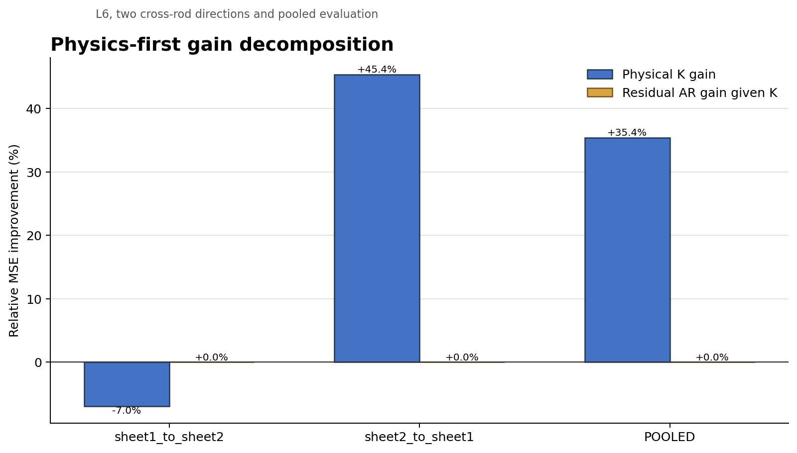
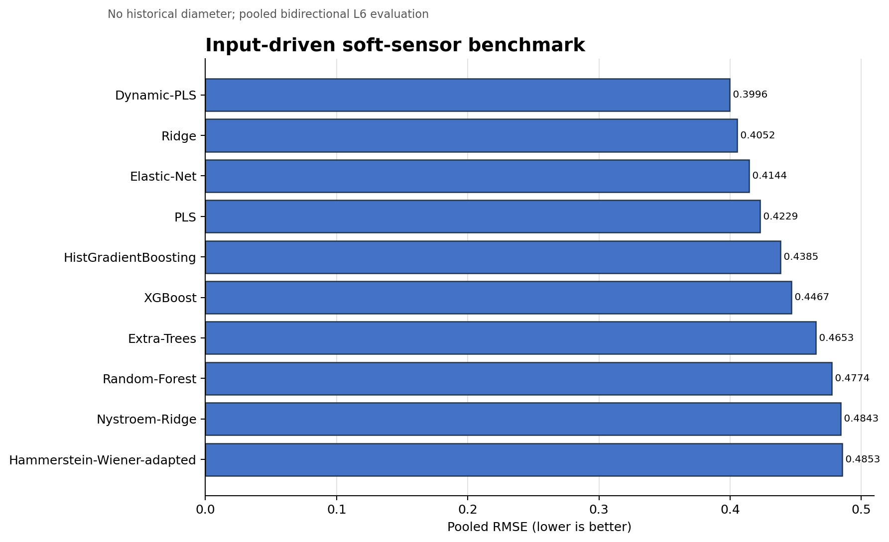
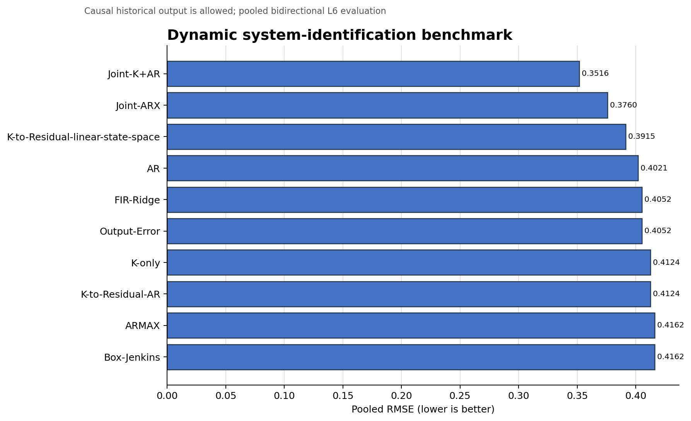

# Physics-First K → Residual-AR CPU Benchmark

## Technical summary

The frozen L6 benchmark completed with status `COMPLETED`. The formal physics-first model achieved pooled RMSE `0.412383` and pooled R² `0.3538`. Physical K reduced pooled persistence MSE by `35.40%`; the strictly matured residual AR changed the remaining K error by `0.00%`. Total pooled gain was `35.40%`.

The decisive transfer result is `NOT_BIDIRECTIONALLY_STABLE`: K changed persistence MSE by `-6.95%` in `sheet1_to_sheet2` and `+45.38%` in `sheet2_to_sheet1`. Therefore the positive pooled gain and pooled bootstrap interval are not registered as bidirectionally stable physical evidence. They are dominated by one transfer direction.

Residual AR registration is `EXACT_ZERO_SELECTED_BOTH_DIRECTIONS`. The formal K→Residual-AR model consequently reduces exactly to K-only in both directions under the frozen one-SE rule.

The input-only winner was `Dynamic-PLS` (MSE `0.159703`), while the dynamic leaderboard winner was `Joint-K+AR` (MSE `0.123652`). These are separate rankings because only the dynamic leaderboard may read historical diameter.

## The physical layer and residual layer make distinct contributions

The figure separates the improvement produced by the frozen joint-lift kernel from the incremental improvement of residual AR. Residual AR only reads errors whose 20-minute horizon and 2-minute target window have fully matured before the current prediction origin.

The pooled physics attribution ratio is `1.0`. The nonlinear K block remained `EXACT_ZERO_BOTH_DIRECTIONS`; this run therefore found no validation-selected nonlinear increment over the linear amplitude subspace. This does not rescue or override the failed bidirectional stability registration of linear K.

## Input-only models are ranked without historical diameter

This leaderboard uses only the four registered controls represented by the same causal multiresolution blocks. It therefore measures soft-sensor performance rather than output persistence.

## Dynamic models are evaluated on the identical final sample mask

AR, ARX, adapted classical identification models, NARX controls, and the physics-first structures use historical output only up to the current origin. Every reported pooled metric uses the shared evaluation mask that leaves enough time for residual maturity and the maximum 40-minute residual history.

## Scope, data and metric definitions

- Data: the two registered workbook sheets, each analyzed only after its last frozen diameter breakpoint.
- Target: future 2-minute mean diameter at +20 minutes minus the current 2-minute mean.
- Cadence/history: 10 seconds and 40 minutes.
- Outer validation: Sheet1→Sheet2 and Sheet2→Sheet1.
- Inner selection: four expanding-window folds with at least 22 minutes of purge; test rods never select hyperparameters.
- `G_K` compares K-only with zero-change persistence; `G_AR|K` compares K→Residual-AR with the frozen K-only prediction.

## Model specification and validation

K is the train-fitted joint-lift PC1 multiresolution linear Urysohn subspace. K is fitted first and frozen. Rolling cross-fit predictions create OOF physical residuals. Residual AR is then selected with an exact zero candidate and cannot backpropagate into or refit K. CPU FP64 is used for K, residual AR, Gram systems, KKT, predictions, metrics and bootstrap.

Maximum certified KKT residual was `2.645e-16` and maximum recorded condition number was `3.616e+01`. FP64 certification status: `PASS`.

Inference timing was recorded for `58` generic model-direction runs. Three retained comparison runs emitted frozen-budget convergence warnings: Sheet1→Sheet2 Elastic-Net and both MLP-small directions. They were not retried or given extra optimization budget after results were observed.

Methods without a reliable paper-faithful Python implementation are explicitly labeled `ADAPTED_IMPLEMENTATION` in the result registry. They remain comparison controls and are not presented as full original-paper reproductions.

## Limitations, uncertainty and robustness

The K bootstrap 95% interval is `[23.63%, 44.95%]`; the residual AR-given-K interval is `[0.00%, 0.00%]`. Direction-specific, first/second-half, common-support, OOD, kernel, and time-shift placebo results are retained in `BOOTSTRAP/physics_first.json`.

The evidence is limited to two rods and the frozen L6 task. It does not establish cross-furnace, cross-stage, or unrestricted industrial generalization. Adapted classical models should be interpreted as equation-level controlled baselines.

`Joint-K+AR` is the best dynamic predictive control in this benchmark, but it is a jointly fitted model. It is not evidence that the frozen physical K is stable across rods and is not used to override the physical registration above.

## Recommended next steps

1. Transfer the immutable shared dataset bundle to the GPU batch; do not regenerate PCA, targets, masks, or splits.
2. Merge CPU and GPU results only after all protocol, target, split and sample-ID hashes match.
3. Preserve K-only as the physical reference and enable residual dynamics only when the registered bidirectional bootstrap evidence is positive.

## Further questions

- Does the same frozen lift kernel remain stable on additional rods and furnace campaigns?
- Do GPU sequence models improve the dynamic leaderboard without reducing the stable physical K contribution?
- Can process metadata distinguish true transport delay from controller and measurement delay?
